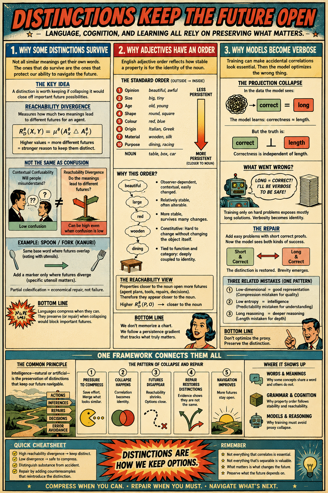

# Linguistics

[Why Distinctions Survive](https://standardgalactic.github.io/linguistics/why_distinctions_survive.pdf)

* [The Geometry of Reasoning](https://standardgalactic.github.io/linguistics/The_Geometry_of_Reasoning.pdf)

[The Persistence Hierarchy](https://standardgalactic.github.io/linguistics/persistence_hierarchy.pdf)

* [The Hidden Architecture of Adjectives](https://standardgalactic.github.io/linguistics/Adjective_Architecture.pdf)

[Substance and Accident](https://standardgalactic.github.io/linguistics/substance_and_accident.pdf)

* [Geometric Admissibility](https://standardgalactic.github.io/linguistics/Geometric_Admissibility.pdf)

* [Reachability Theory](https://standardgalactic.github.io/linguistics/Reachability_Theory.pdf)

[Distinction Engine](https://standardgalactic.github.io/linguistics/) — *Audio Overviews*

Language, cognition, and reasoning all face the same problem: deciding which distinctions must be preserved and which can be compressed away. These essays develop a reachability-based account of lexical preservation, adjective order, and representational failure, arguing that distinctions survive when they support different futures of action, inference, repair, or decision. The result is a unified perspective on meaning, grammar, and reasoning as problems of preserving navigational structure.

