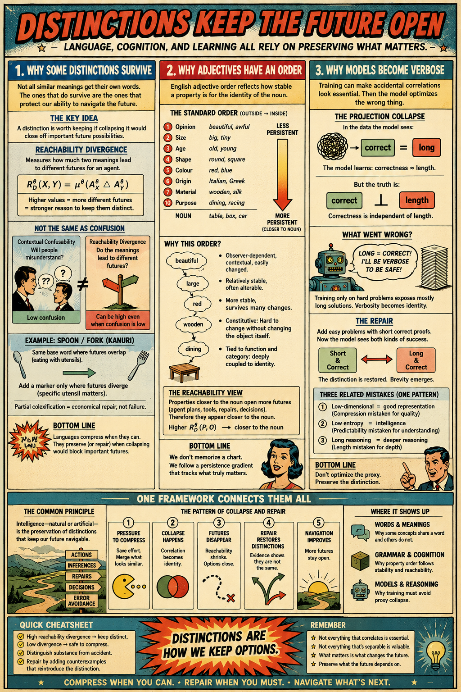

# Linguistics

[English in Arabic Script](https://standardgalactic.github.io/linguistics/english-in-arabic-script.pdf)

* [Cheatsheet](https://standardgalactic.github.io/linguistics/arabglish-cheatsheet.pdf)

[Why Distinctions Survive](https://standardgalactic.github.io/linguistics/why_distinctions_survive.pdf)

* [The Geometry of Reasoning](https://standardgalactic.github.io/linguistics/The_Geometry_of_Reasoning.pdf)

[The Persistence Hierarchy](https://standardgalactic.github.io/linguistics/persistence_hierarchy.pdf)

* [The Hidden Architecture of Adjectives](https://standardgalactic.github.io/linguistics/Adjective_Architecture.pdf)

[Substance and Accident](https://standardgalactic.github.io/linguistics/substance_and_accident.pdf)

* [Geometric Admissibility](https://standardgalactic.github.io/linguistics/Geometric_Admissibility.pdf)

* [Reachability Theory](https://standardgalactic.github.io/linguistics/Reachability_Theory.pdf)

[Distinction Engine](https://standardgalactic.github.io/linguistics/) — *Audio Overviews*

Language, cognition, and reasoning all face the same problem: deciding which distinctions must be preserved and which can be compressed away. These essays develop a reachability-based account of lexical preservation, adjective order, and representational failure, arguing that distinctions survive when they support different futures of action, inference, repair, or decision. The result is a unified perspective on meaning, grammar, and reasoning as problems of preserving navigational structure.



## English in Arabic Script

English written word for word in standard Arabic letters, with optional fatha, damma, kasra and sukoon. Nothing is translated: the words, their order and their meaning stay English, and only the script changes. The notation is phonetic in its consonants and partly orthographic in its vowels, so a familiar word such as *book* keeps its waw (`بُوكْ`).

| | |
|---|---|
| `english-in-arabic-script.pdf` | The monograph: notation, evidence, tools, worked passages |
| `arabglish-cheatsheet.pdf` | One-page reading and writing sheet |
| `monograph/` | LaTeX source of the book (`main.tex`, `chapters/`, `generated/`) |
| `cheatsheet/` | LaTeX source of the cheat sheet |
| `arabic-english/` | The Python tools: forward transliterator, reverse reader, linter, tests, specimens, legacy sources |

### Conventions in brief

* Standard Arabic letters only; no Persian additions.
* p and b are `ب`; v and f are `ف`; hard g is `غ`; ch is `تْش`; sh is `ش`; voiced th is `ذ`; voiceless th is `ث`; ng is `نغ`.
* Short vowel marks go on the preceding consonant. Sukoon `ْ` marks a consonant with no following vowel.
* Marks are optional: the same letters can be shown with all marks, vowel marks only, or none.
* Some English spelling shows through (`بُوكْ` for *book*), so the notation is a hybrid of pronunciation and spelling.
* Choices the specimens do not settle are switches: `--v b|f|context`, `--g ghain|jeem`, `--density`, `--digits`, `--attested`.

### Using the tools

```
python3 arabic-english/main.py "The book is written in English."
cd arabic-english && python3 -m pytest -q tests
cd arabic-english && PYTHONPATH=src python3 -m arabglish --help
```

The command line has `fwd` (English to Arabic script), `rev` (ranked English candidates for Arabic-script text), `lint`, `stats`, `glossary` and `roundtrip`. Pronunciations come from the CMU Pronouncing Dictionary through `cmudict`; install the dependencies with `pip install cmudict wordfreq pytest`.

### Building the book and cheat sheet

```
make            # regenerate tables and passages, build both PDFs
make test       # run the tests
make clean      # remove LaTeX build files
```

The book needs XeLaTeX, DejaVu Sans (Arabic text), and FreeSerif and FreeMono. Every table and example in the book is generated from the code, so the book and the tools cannot drift apart. `arabic-english/legacy/` keeps the earlier AutoHotkey layout and Python scripts for reference.